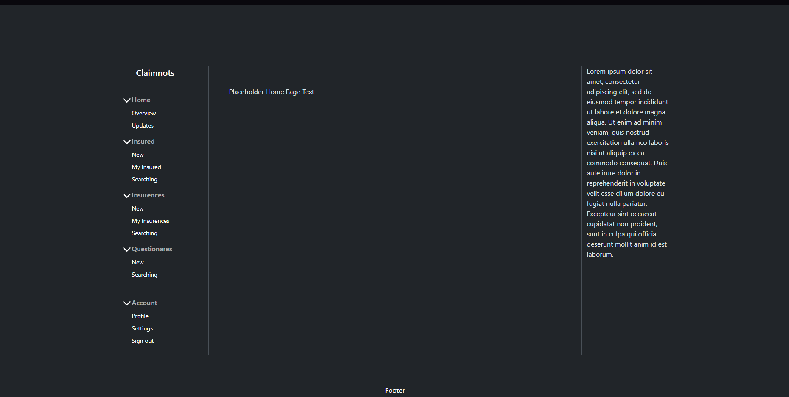
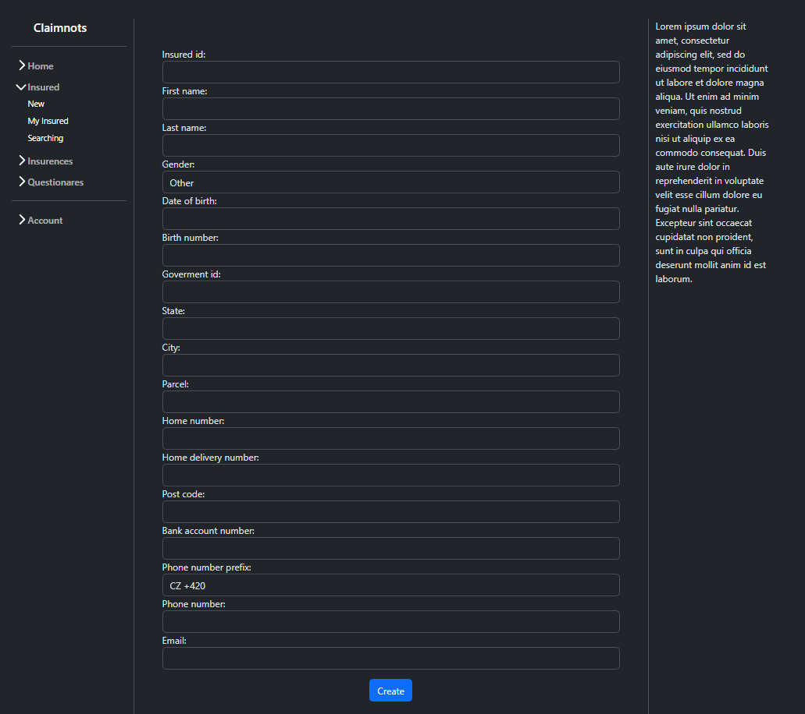
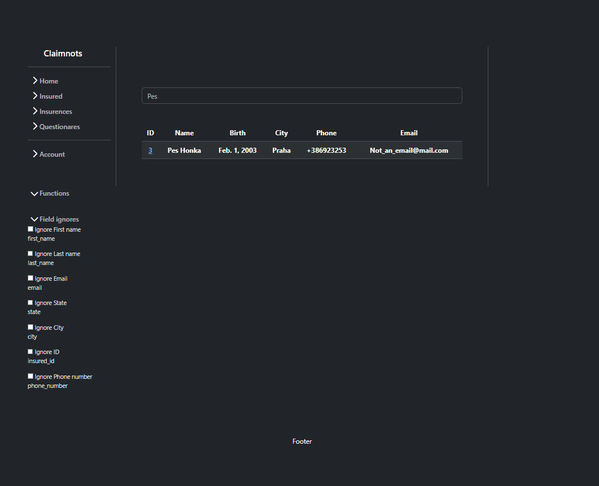
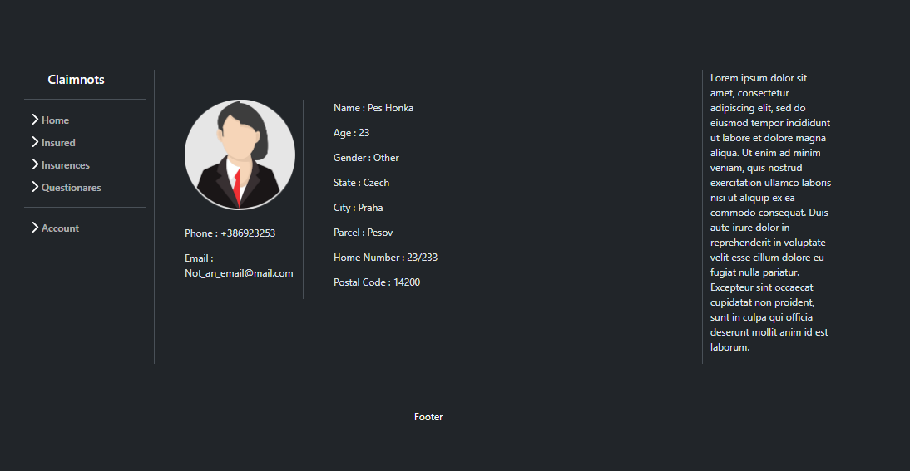

# Django Insurance Evidence System

A web-based insurance evidence management application built with Django.

The project focuses on creating a maintainable full-stack web application for managing insured persons, storing records, searching through existing entries, and handling insurance-related data through an interactive web interface.

---

## Overview

This project is a full-stack Django application designed to manage insured persons and their information through a browser-based interface.

Users can:

* Create insured person records
* Browse and manage stored information
* Search through existing records
* View detailed person profiles
* Manage insurance-related data through forms and database-backed pages

The goal of this project was to learn how larger Django applications are structured while working with databases, templates, forms, routing, and CRUD operations.

---

## Still To Do

Planned improvements:

* Authentication and user accounts
* Permission system / role separation
* Better form validation using Javascripts
* Pagination for larger datasets
* Improved UI styling
* REST API support
* Docker deployment
* Automated tests

---

## Technical Highlights

### Object-Oriented Architecture

The project separates responsibilities into reusable Django components:

* Models for database representation
* Views for business logic
* Templates for frontend rendering
* Forms for validation and input handling
* URL routing for navigation

### Systems Implemented

* CRUD operations
* Search functionality
* Dynamic profile pages
* Database integration
* Form handling and validation
* Template rendering
* Static asset management

### Software Engineering Concepts

This project focuses on:

* MVC / MVT architecture
* Database design
* Separation of concerns
* Full-stack web development
* Multi-file project organization
* Backend and frontend integration
* Incremental feature development

---

## Project Structure

```text
Insurence_evidation-Django/
│
├── mainsite/
│   ├── templates/
│   ├── static/
│   ├── models.py
│   ├── views.py
│   ├── forms.py
│   └── urls.py
│
├── manage.py
├── requirements.txt
└── README.md
```

---

## Technologies Used

* Python
* Django
* HTML
* CSS
* SQLite
* Django Templates

---

## Running Locally

Clone repository:

```bash
git clone https://github.com/YOUR_USERNAME/Insurence_evidation-Django.git
cd Insurence_evidation-Django/mainsite
```

Create virtual environment:

```bash
python -m venv venv
```

Activate environment:

Windows:

```bash
venv\Scripts\activate
```

Linux / Mac:

```bash
source venv/bin/activate
```

Install dependencies:

```bash
pip install -r requirements.txt
```

Run migrations:

```bash
python manage.py migrate
```

Start server:

```bash
python manage.py runserver
```

Open:

```text
http://127.0.0.1:8000/Insurence_Web/
```

---

## Skills Demonstrated

* Django development
* Database integration
* CRUD operations
* Backend development
* Form handling and validation
* Search implementation
* Template systems
* Project organization
* Full-stack application development

---

## Screenshots

### Home Page



### Person Creation



### Search Function



### Insured Person Profile



---

## Project Goal

The goal of this project was to move beyond small scripts and build a larger full-stack application while learning how real-world web applications manage routing, databases, templates, forms, and user interaction.

This project focuses not only on functionality but also on understanding how maintainable backend systems are structured and expanded over time.
